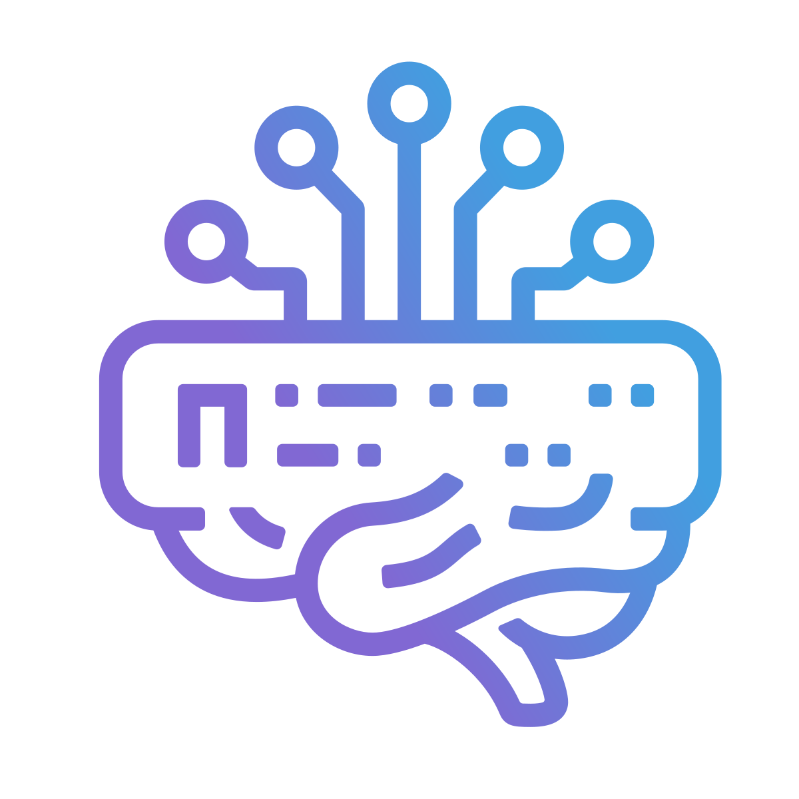

<p align="center">
  
</p>

# AgentMux

**Watch Your Agents. Stay in Control.**

A rich monitoring and orchestration UI for AI agents. See every tool call, catch regressions mid-task, and tune your agent system in real time.

[](https://opensource.org/licenses/Apache-2.0)
[](https://agentmux.ai)

## The Problem

Knowledge workers running AI agents across long-horizon tasks are blind while it happens. You can't see which agent found something important. You can't see which one went off-track. You can't redirect mid-task. You find out when it's done, or when something is wrong.

- **Agents regress.** An agent fixes a bug and then undoes its own work in a later step. By the time you notice, the context is cold and the decision chain is opaque.
- **Guardrails are tuned blind.** No live signal on which constraints are firing, which are too tight, which agents are working around.
- **Multi-agent conflicts are invisible.** Two agents reach conflicting conclusions. The synthesis picks one. You never know the conflict happened.

## What AgentMux Does

AgentMux is an open-source desktop application that surfaces what agents are doing in real time: tool calls, reasoning steps, source citations, output streams, and conflicts between agents. The human role is observer and supervisor, not driver.

Cross-platform (Windows, macOS, Linux). 100% Rust backend (Tokio + Axum). Tauri v2. Apache 2.0.

- **Live agent monitoring** — Watch every tool call and decision step as it happens. Catch an agent undoing correct work mid-task and redirect it before the damage compounds.
- **Multi-agent orchestration** — Run parallel agents and see all of them at once. Spot conflicts before synthesis. Redirect any agent without killing the others.
- **Guardrail observability** — See which constraints are active and firing. Tune your agent system from live signal, not post-mortem guesswork.
- **Built-in Claude integration** — Agent sessions are first-class citizens alongside terminals, editor, and system metrics.
- **Forge widget** — Agent picker wired to live Forge data for orchestration workflows.
- **Drag and drop** — Drag files into terminal panes, reorder widgets, drag panes and tabs across windows.
- **Per-pane zoom** — Independent zoom level per pane, plus global chrome zoom.
- **Real PTY support** — Authentic terminal emulation via xterm.js and portable-pty.
- **Shell integration** — `wsh` binary deployable to remote hosts for multiplexed sessions.

## Quick Start

### Prerequisites

| Tool | Version | Purpose |
|------|---------|---------|
| **Node.js** | 22 LTS | Frontend build |
| **Rust** | 1.77+ | Backend + Tauri |
| **[Task](https://taskfile.dev/)** | Latest | Build orchestration |

Platform-specific:
- **Windows:** WebView2 (pre-installed on 10/11), Visual Studio Build Tools
- **macOS:** Xcode Command Line Tools
- **Linux:** `libwebkit2gtk-4.1-dev`, `libappindicator3-dev`, `librsvg2-dev`

### Development

```bash
npm install        # install frontend dependencies
task dev           # hot reload — frontend auto-reloads, Tauri rebuilds on Rust changes
```

### Production Build

```bash
task package              # platform installer (NSIS / DMG / AppImage)
task package:macos        # macOS .app + .dmg (copies to Desktop)
task package:portable     # Windows portable ZIP
task package:portable:linux  # Linux AppImage
```

## Pane Types

| View | Description |
|------|-------------|
| `term` | Terminal with xterm.js and real PTY |
| `agent` | AI agent pane (Claude integration, multi-provider) |
| `codeeditor` | Monaco-based code editor |
| `sysinfo` | Live system metrics (CPU, memory, network) |
| `webview` | Embedded web browser |
| `forge` | Agent orchestration — picker wired to live Forge data |
| `help` | Built-in documentation viewer |

## Architecture

```
AgentMux          (Tauri v2 — Rust + platform WebView)
 └── agentmuxsrv-rs   (Rust async backend — Tokio + Axum + SQLite, auto-spawned sidecar)
      └── wsh-rs       (Rust shell integration CLI, deployed to remotes)
```

**Stack:**
- **Frontend:** React 19 + TypeScript + Vite + Jotai
- **Backend:** Rust (Tokio + Axum + SQLite + portable-pty)
- **Desktop:** Tauri v2
- **Terminal:** xterm.js + Monaco Editor

## Build Commands

| Command | Description |
|---------|-------------|
| `task dev` | Development mode with hot reload |
| `task quickdev` | Fast dev (skips wsh build) |
| `task package` | Production installer for current platform |
| `task package:macos` | macOS .app + .dmg |
| `task package:portable` | Windows portable ZIP |
| `task package:portable:linux` | Linux AppImage |
| `task build:backend` | Build agentmuxsrv-rs + wsh-rs |
| `task build:frontend` | Build frontend only |
| `task test` | Run tests (vitest) |
| `task clean` | Clean build artifacts |

### Build Outputs

| Platform | Artifact |
|----------|----------|
| **macOS** | `target/release/bundle/macos/AgentMux_*_aarch64.dmg` |
| **Windows** | `src-tauri/target/release/bundle/nsis/AgentMux_*.exe` |
| **Linux** | `target/release/bundle/appimage/AgentMux_*_amd64.AppImage` |

## Version Management

Always use [`@a5af/bump-cli`](https://github.com/a5af/bump-cli) — never edit version numbers manually.

```bash
bump patch -m "Description" --commit   # bump, stage, and commit all version files
bump verify                            # check all files are consistent
bump show                              # display current version state
```

Config lives in `.bump.json`. See [BUILD.md](./BUILD.md) for the full workflow.

## License

Developed by **[AgentMux Corp.](https://agentmux.ai)** — Delaware corporation.

Apache-2.0 — Originally forked from [Wave Terminal](https://github.com/wavetermdev/waveterm)
